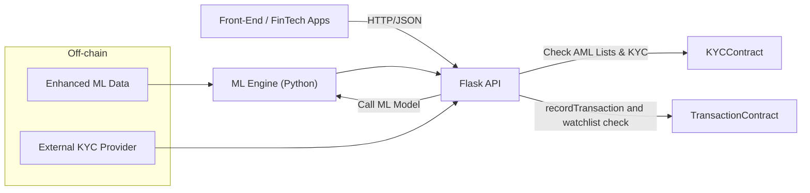

# Blockchain + ML API for Finance

A **data-driven** and **trust-enhanced** solution that merges **smart contracts** on the Ethereum (testnet) with an **off-chain ML** engine for **real-time risk scoring**, **KYC/AML** compliance, and **fraud detection**.

## Table of Contents

- [Overview](#overview)
- [Architecture](#architecture)
- [Getting Started](#getting-started)
  - [Prerequisites](#prerequisites)
  - [Environment Variables](#environment-variables)
  - [Installation](#installation)
- [Deployment](#deployment)
  - [Compiling \& Deploying Contracts](#compiling--deploying-contracts)
  - [Running the API](#running-the-api)
- [Usage](#usage)
  - [API Endpoints](#api-endpoints)
    - [1. Record a Transaction](#1-record-a-transaction)
    - [2. Flag/Unflag an Address](#2-flagunflag-an-address)
    - [3. Update KYC Information](#3-update-kyc-information)
- [Project Structure](#project-structure)
- [Roadmap](#roadmap)
- [License](#license)

---

## Overview

**Challenge**: Financial institutions need robust methods to **prevent fraud**, comply with **KYC/AML** regulations, and maintain an **immutable** record of transactions and risk scores.

**Solution**: Combine **blockchain** for immutability and **machine learning** for real-time risk assessment:

1. **Smart Contracts** store transaction data, KYC verification statuses, and ML-generated risk scores.
2. **ML Engine** (Python) computes fraud or credit risk probabilities using enhanced features and alternative algorithms.
3. **API Layer** (Flask) orchestrates requests, calls the ML model, and records data on-chain.

---

## Architecture



1. **Front-End**: A web or mobile client calls the API for transaction processing or KYC checks.
2. **Flask API**: Receives requests, extracts features for ML scoring, interacts with blockchain contracts, and handles KYC/AML compliance.
3. **ML Engine**: Predicts fraud or risk scores using an advanced ML model (`fraud_model.joblib`) with enhanced features.
4. **Smart Contracts**:
   - **KYCContract**: Stores hashed KYC documents and verification statuses.
   - **TransactionContract**: Records transactions, risk scores, and manages AML watchlists.
5. **Off-chain Components**:
   - **Enhanced ML Data**: Incorporates historical user data and advanced profiling.
   - **External KYC Providers**: Integrates with third-party services for automated KYC verification.

---

## Getting Started

### Prerequisites

- **Node.js** (v16 or higher recommended)
- **Python** (3.10 or 3.11 recommended)
- **npm** or **yarn**
- **Hardhat** (installed via npm)
- **MetaMask** (optional, for interacting directly with deployed contracts)
- **Sepolia test ETH** (obtain from a [faucet](https://www.alchemy.com/overviews/sepolia-faucet)) for gas fees

### Environment Variables

Create a **\.env** file in the project root or in the `python/` folder. Example:

```bash
# .env example

WEB3_PROVIDER=https://sepolia.infura.io/v3/<YOUR_INFURA_PROJECT_ID>
TX_CONTRACT_ADDR=0xYourTransactionContractAddress
KYC_CONTRACT_ADDR=0xYourKYCContractAddress
PRIVATE_KEY=0xyourSepoliaPrivateKeyWithTestETH
MODEL_PATH=fraud_model.joblib  # Path to your ML model file
```

### Installation

1. **Clone** this repository:
   ```bash
   git clone https://github.com/yourusername/your-blockchain-ml-project.git
   cd your-blockchain-ml-project
   ```

2. **Install Node dependencies**:
   ```bash
   npm install
   ```
   (Installs Hardhat, toolbox, etc.)

3. **Install Python dependencies** (in the `python` folder):
   ```bash
   cd python
   pip install -r requirements.txt
   cd ..
   ```

---

## Deployment

### Compiling & Deploying Contracts

1. **Check** your Hardhat config (`hardhat.config.js`) to ensure it points to Sepolia (or your desired network).

2. **Compile** the contracts:
   ```bash
   npx hardhat compile
   ```

3. **Deploy** the contracts to Sepolia:
   ```bash
   npx hardhat run scripts/deploy.js --network sepolia
   ```

4. **Note** the addresses for `KYCContract` and `TransactionContract` from the deployment output. Update your **\.env** file accordingly:
   ```bash
   TX_CONTRACT_ADDR=0xDeployedTransactionContractAddress
   KYC_CONTRACT_ADDR=0xDeployedKYCContractAddress
   ```

### Running the API

1. **Ensure** ABI files are placed correctly:
   - `python/KYCContractABI.json`
   - `python/TransactionContractABI.json`

2. **In the project root** or `python` folder:
   ```bash
   cd python
   python api_server.py
   ```

3. **Flask server** will start on **http://127.0.0.1:5000** by default.

---

## Usage

### API Endpoints

Your API exposes three main endpoints: `/api/transaction`, `/api/flag-address`, and `/api/kyc`. Below are the details and example `curl` commands for each.

#### 1. Record a Transaction

**Endpoint**: `POST /api/transaction`  
**Description**: Records a transaction with an ML-generated risk score.

**Request Body** (JSON):
```json
{
  "amount": 200,
  "receiver": "0xAbCd1234...someSepoliaAddress...",
  "features": [5000, 2, 1, 0]
}
```

**One-liner cURL**:
```bash
curl -X POST http://127.0.0.1:5000/api/transaction -H "Content-Type: application/json" -d "{"amount": 200, "receiver": "0xF39Fd6e51aad88F6F4ce6Ab8827279cffFb92266", "features": [5000, 2, 1, 0]}"
```

**Expected Response** (JSON):
```json
{
  "status": "success",
  "transactionHash": "0x123456789abcdef...",
  "riskScore": 450,
  "blockNumber": 1812345
}
```

#### 2. Flag/Unflag an Address

**Endpoint**: `POST /api/flag-address`  
**Description**: Flags or unflags an Ethereum address for AML compliance.

**Request Body** (JSON):
```json
{
  "address": "0xAbCdEf1234567890abcdef1234567890abcdef12",
  "flag": true
}
```

**One-liner cURL**:
```bash
curl -X POST http://127.0.0.1:5000/api/flag-address -H "Content-Type: application/json" -d "{"address": "0xAbCdEf1234567890abcdef1234567890abcdef12", "flag": true}"
```

**Expected Response** (JSON):
```json
{
  "status": "dummy success for flag-address"
}
```

(*Note: This endpoint currently returns a dummy success response.)

#### 3. Update KYC Information

**Endpoint**: `POST /api/kyc`  
**Description**: Updates KYC information by storing a hashed identity document and its verification status on-chain.

**Request Body** (JSON):
```json
{
  "docHashHex": "0xYourDocumentHashHexValue",
  "verified": true
}
```

**One-liner cURL**:
```bash
curl -X POST http://127.0.0.1:5000/api/kyc -H "Content-Type: application/json" -d "{"docHashHex": "0xYourDocumentHashHexValue", "verified": true}"
```

**Expected Response** (JSON):
```json
{
  "status": "dummy success for update-kyc"
}
```

(*Note: This endpoint currently returns a dummy success response.)

**Notes for Endpoints**:
- Replace placeholders like `"0xYourDocumentHashHexValue"` with actual values.
- The `/api/flag-address` and `/api/kyc` endpoints currently have dummy implementations. You can extend these with actual logic as needed.

---

## Project Structure

```
my-blockchain-ml-project
├── contracts
│   ├── KYCContract.sol
│   └── TransactionContract.sol
├── scripts
│   └── deploy.js
├── hardhat.config.js
├── python
│   ├── KYCContractABI.json
│   ├── TransactionContractABI.json
│   ├── ml_engine.py
│   ├── api_server.py
│   ├── requirements.txt
│   └── fraud_model.joblib   (trained model file)
└── README.md
```

- **contracts/**: Solidity smart contracts (`KYCContract.sol` & `TransactionContract.sol`).
- **scripts/**: Hardhat deployment scripts (`deploy.js`).
- **hardhat.config.js**: Hardhat compiler and network settings.
- **python/**:
  - **KYCContractABI.json**: ABI for `KYCContract`.
  - **TransactionContractABI.json**: ABI for `TransactionContract`.
  - **ml_engine.py**: ML model loading and prediction logic.
  - **api_server.py**: Flask API server handling requests.
  - **requirements.txt**: Python dependencies.
  - **fraud_model.joblib**: Trained ML model file.
- **README.md**: This documentation.

---

## Roadmap

1. **Enhance ML**:
   - Add more features (historical user data, advanced user profiling).
   - Try alternative algorithms (XGBoost, neural networks).

2. **KYC Automation**:
   - Hash user identity documents and store references on-chain.
   - Integrate off-chain KYC providers for automated verification.

3. **Compliance & AML**:
   - Flag suspicious addresses and transactions.
   - Add watchlists for high-risk countries.

4. **Scaling**:
   - Dockerize the Python API and ML model for load balancing.
   - Explore Layer 2 solutions (e.g., Polygon, Arbitrum) to reduce gas costs.

---

## License

This project is licensed under the **MIT License** – see the [LICENSE](LICENSE) file for details.
