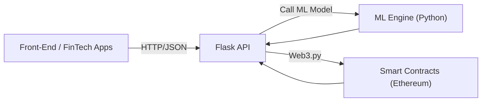

# Blockchain + ML API for Finance

A **data-driven** and **trust-enhanced** solution that merges **smart contracts** on the Ethereum (testnet) with an **off-chain ML** engine for **real-time risk scoring**, **KYC/AML** compliance, and **fraud detection**.

## Table of Contents

- [Overview](#overview)  
- [Architecture](#architecture)  
- [Getting Started](#getting-started)  
  - [Prerequisites](#prerequisites)  
  - [Environment Variables](#environment-variables)  
  - [Installation](#installation)  
- [Deployment](#deployment)  
  - [Compiling \& Deploying Contracts](#compiling--deploying-contracts)  
  - [Running the API](#running-the-api)  
- [Usage](#usage)  
  - [Example Endpoint Call](#example-endpoint-call)  
- [Project Structure](#project-structure)  
- [Roadmap](#roadmap)  
- [License](#license)

---

## Overview

**Challenge**: Financial institutions need robust methods to **prevent fraud**, comply with **KYC/AML** regulations, and maintain an **immutable** record of transactions and risk scores.

**Solution**: Combine **blockchain** for immutability and **machine learning** for real-time risk assessment:

1. **Smart Contracts** store transaction data, KYC verification statuses, and ML-generated risk scores.  
2. **ML Engine** (Python) computes fraud or credit risk probabilities.  
3. **API Layer** (Flask) orchestrates requests, calls the ML model, and records data on-chain.

---

## Architecture



1. **Front-End**: A web or mobile client calls the API for transaction processing or KYC checks.  
2. **Flask API**: Receives requests, extracts features for ML scoring, and interacts with blockchain.  
3. **ML Engine**: Predicts fraud or risk scores using a scikit-learn model (`fraud_model.joblib`).  
4. **Smart Contracts**: Transactions, KYC data, and ML risk scores stored immutably on Ethereum testnet (e.g., Sepolia).

---

## Getting Started

### Prerequisites

- **Node.js** (v16 or higher recommended)  
- **Python** (3.10 or 3.11 recommended)  
- **npm** or **yarn**  
- **Hardhat** (installed via npm)  
- **MetaMask** (optional, if you want to interact directly with deployed contracts)  
- **Sepolia test ETH** (obtain from a [faucet](https://www.alchemy.com/overviews/sepolia-faucet)) for gas fees

### Environment Variables

Create a **`.env`** file in the project root (or in `python/` folder). For example:

```bash
# .env example

WEB3_PROVIDER="https://sepolia.infura.io/v3/<YOUR_INFURA_PROJECT_ID>"
TX_CONTRACT_ADDR="0xYourTransactionContractAddress"
PRIVATE_KEY="0xyourSepoliaPrivateKeyWithTestETH"
MODEL_PATH="fraud_model.joblib"  # If your ML engine uses a custom path
```

### Installation

1. **Clone** this repo:
   ```bash
   git clone https://github.com/yourusername/your-blockchain-ml-project.git
   cd your-blockchain-ml-project
   ```

2. **Install Node dependencies**:
   ```bash
   npm install
   ```
   (Installs Hardhat, toolbox, etc.)

3. **Install Python dependencies** (in the `python` folder):
   ```bash
   cd python
   pip install -r requirements.txt
   cd ..
   ```

---

## Deployment

### Compiling \& Deploying Contracts

1. **Check** your Hardhat config (`hardhat.config.js`) to ensure it points to Sepolia (or your desired network).
2. **Compile**:
   ```bash
   npx hardhat compile
   ```
3. **Deploy**:
   ```bash
   npx hardhat run scripts/deploy.js --network sepolia
   ```
4. **Note** the addresses for `KYCContract` and `TransactionContract`. Update your **`.env`** (e.g., `TX_CONTRACT_ADDR`) accordingly.

### Running the API

1. **In the project root** or `python` folder:
   ```bash
   cd python
   python api_server.py
   ```
2. Flask server will start on **http://127.0.0.1:5000** by default.

---

## Usage

### Example Endpoint Call

**Endpoint**: `POST /api/transaction`  
**Body** (JSON):

```json
{
  "amount": 200,
  "receiver": "0xAbCd1234...someSepoliaAddress...",
  "features": [5000, 2, 1, 0]
}
```

**cURL** example:

```bash
curl -X POST http://127.0.0.1:5000/api/transaction \
  -H "Content-Type: application/json" \
  -d '{
    "amount": 200,
    "receiver": "0xAbCd1234...",
    "features": [5000, 2, 1, 0]
  }'
```

**Response** (JSON), for example:

```json
{
  "status": "success",
  "transactionHash": "0x123456789abcdef...",
  "riskScore": 450,
  "blockNumber": 1812345
}
```

- **status**: success or error  
- **transactionHash**: On-chain transaction that recorded your data  
- **riskScore**: ML model output (0..1000)  
- **blockNumber**: The block number where this transaction was mined on Sepolia

---

## Project Structure

```
my-blockchain-ml-project
├── contracts
│   ├── KYCContract.sol
│   └── TransactionContract.sol
├── scripts
│   └── deploy.js
├── hardhat.config.js
├── python
│   ├── ml_engine.py
│   ├── api_server.py
│   ├── requirements.txt
│   └── fraud_model.joblib   (trained model file)
└── README.md
```

- **contracts/**: Solidity smart contracts (KYC + Transaction).  
- **scripts/**: Hardhat deployment scripts.  
- **python/**: ML engine, API server, and Python dependencies.  
- **hardhat.config.js**: Hardhat compiler + network settings.  
- **README.md**: This documentation.

---

## Roadmap

1. **Enhance ML**:
   - Add more features (historical user data, advanced user profiling).  
   - Try alternative algorithms (XGBoost, neural networks).

2. **KYC Automation**:
   - Hash user identity docs, store references on-chain.  
   - Integrate off-chain KYC providers for automated verification.

3. **Compliance \& AML**:
   - Flag suspicious addresses and transactions.  
   - Add watchlists for high-risk countries.

4. **Scaling**:
   - Dockerize the Python API + ML model for load balancing.  
   - Explore L2 solutions (e.g., Polygon, Arbitrum) to reduce gas costs.

---

## License

This project is licensed under the **MIT License** – see the [LICENSE](LICENSE) file for details.
